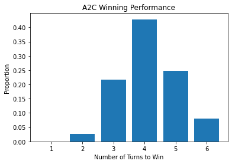

# WordleRL
 Reinforcement Learning with Wordle

```python
import numpy as np
import seaborn as sns
import matplotlib.pyplot as plt
import tensorflow as tf
from tensorflow import keras
from keras import layers
import os
```


```python
from Wordle import *
from Player import *
from Environment import *
from AdvantageActorCritic import *
from word_functions import *
from get_word_funcs import *
```

# Import Model and Weights


```python
total_words, answer_words, acceptable_words = get_words(True)
one_hot_total = one_hot_words().astype(np.float32)
one_hot_ind = list(range(len(total_words)))
```


```python
A2C = AdvantageActorCritic(one_hot_total, one_hot_ind)
A2C.compile(optimizer = keras.optimizers.RMSprop(0.0001), loss = [critic_loss, actor_loss])
A2C.load_weights('EMH_Model_Weights/Wordle2_AAC_weights_2222')
```


    <tensorflow.python.training.tracking.util.CheckpointLoadStatus at 0x1a2d010a0>


# Play a Game


```python
"""If you have a specific word in mind replace "state" with some other word
"""
rand = np.random.choice(answer_words)
env = Environment(rand)
```

### A2C Performance


```python
env = Environment(rand)
while not env.wordle.over:
    action, value = A2C.action_value(env.state[np.newaxis])
    action = action.numpy()[0][0]
    env.step(action)
print(env.wordle.guesses)
print(env.wordle.answer)
```

    ['siege', 'pooch', 'alary', 'lumpy']
    lumpy


### 3Blue1Brown Performance


```python
p = Player()
env.reset(rand)
p.reset()
while not env.wordle.over:
    action = np.where(total_words == p.exp_info_strategy())[0][0]
    env.step(action)
    p.guess(total_words[action], env.wordle.hints[-1])
print(p.guesses)
```

    ['rates', 'login', 'lucky', 'lumpy']


## Compare with 3Blue1Brown's Strategy


```python
def get_wordle_performance():
    if os.path.exists('Data/3b1b_performance.npy'):
        player_win_turns = np.load('Data/3b1b_performance.npy')
    else:
        player_win_turns = []
        player_win_score = 0
        env = Environment()
        p = Player()
        for answer in answer_words:
            env.reset(answer)
            p.reset()
            while not env.wordle.over:
                action = np.where(total_words == p.exp_info_strategy())[0][0]
                env.step(action)
                p.guess(total_words[action], env.wordle.hints[-1])
            player_win_score += env.wordle.win
            player_win_turns.append(env.num_guesses)
        player_win_turns = np.array(player_win_turns)
        np.save('Data/3b1b_performance.npy', player_win_turns)
    return player_win_turns
tb1b_performance = get_wordle_performance()
        
```


```python
nn_performance = []
nn_avg = []
wins = 0
for answer in answer_words:
    env.reset(answer)
    while not env.wordle.over:
        action, value = A2C.action_value(env.state[np.newaxis])
        action = action.numpy()[0][0]
        env.step(action)
    if env.wordle.win:
        wins+=1
        nn_performance.append(env.wordle.guess_count)
        nn_avg.append(env.wordle.guess_count)
    else:
        nn_performance.append(7)
print('A2C Wins: '+str(wins))
print('A2C Losses: '+ str(len(total_words) - wins))
win_percentage = wins / len(answer_words)
print('A2C Win Ratio: ' + str(win_percentage))
print('A2C Average Number of Guesses per Win: '+str(np.mean(nn_avg)))
print('3B1B Average Number of Guesses per Win: '+str(np.mean(tb1b_performance)))
```

    A2C Wins: 2221
    A2C Losses: 10751
    A2C Win Ratio: 0.9618882633174535
    A2C Average Number of Guesses per Win: 4.063484916704187
    3B1B Average Number of Guesses per Win: 3.878735383282806


```python
data = np.array(np.vstack((nn_performance, tb1b_performance))).transpose()
df = pd.DataFrame(data, columns=['A2C', '3B1B'])
```


```python
min_val = 2
max_val = 6
val_width = max_val - min_val
n_bins = 6
bin_width = val_width/n_bins
print('A2C wins: ' +str(wins))
#print('Player wins: ' +str(player_win_score))
sns.histplot(data = df,
             multiple='dodge',binwidth=None, legend=True )

```

    A2C wins: 2221


    <AxesSubplot:ylabel='Count'>


    

    


```python
plt.hist(nn_performance, bins = 6, rwidth=0.8, align='left', density = True)
plt.title('A2C Winning Performance')
plt.xlabel('Number of Turns to Win')
plt.ylabel('Proportion')
plt.show()
```


    

    


```python

```
