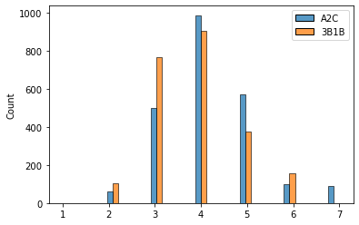

# Reinforcement Learning with Wordle

This project was inspired by [3Blue1Brown's](https://www.youtube.com/watch?v=v68zYyaEmEA) video on Wordle Strategies. After implementing the greedy one-step strategy presented in the video, I wanted to see how an RL agent could do in comparison. The RL implementation of the Advantage Actor Critic was heavily influenced by [Andrew Ho](https://wandb.ai/andrewkho/wordle-solver/reports/Solving-Wordle-with-Reinforcement-Learning--VmlldzoxNTUzOTc4) with some modifications. Below we can see an animation of how A2C performs:

# State and Action Representation

While this is quite similar to Andrew Ho's implementation, when using the state representation that was length 417, it seemed that my model was plateauing on the 100-word and 1000-word smaller games. To aid in this, I used the following state representation:

- Position 0 is the number of guesses remaining in the game
- Positions 1-26 document which letters have been attempted before, being a 1 if they had and a 0 if they have not
- Positions 27-52 document which letters are known to be in the word, corresponding to a 1 if that letter is known to be yellow or green after guessing.
- Positions 53 - 182 correspond to the concatenation of 26 one-hot vectors of length 3 corresponding to [No, Maybe, Yes]. This gives information for each letter of whether it belongs in the first position or not, or whether it is not known.
- Positions 183-442 repeat the idea for positions 53-182 of the state vector, but corresponding to the second letter, third letter, and so on in the word.

The key difference between my implementation of the state and what I was referencing is the addition of positions 27-52, as I felt that there could be more information added for getting a yellow letter. Without positions 27-52, I felt that having a yellow letter only changed the state in the sense of "this letter does not belong in this position," while leaving out the caveat of "but this letter IS found in the word."

The action representation is identical to the reference: the model outputs a vector of length 130, notably 5x26, giving a value for how "good" it would be to guess that letter in that position (i.e. the last entry of this vector would be how "good" it would be to choose 'z' as the last letter). After outputting this vector, it is multiplied by a matrix of size (total number of words) by 130, in the case of the full game 12,972 by 130. Each row of this matrix looks like 5 one-hot vectors of length 26 concatenated together, displaying which letters showed up in which position. 

## Comparing Guesses Between AdvantageActorCritic and 3Blue1Brown

| 3Blue1Brown | AdvantageActorCritic |
| :-- | :-- |
| rates | siege |
| login | pooch | 
|lucky | alary |
|  lumpy  |  lumpy | 

## Comparing Performance Between the Two Strategies

    A2C Wins: 2221
    A2C Losses: 88
    A2C Win Ratio: 0.9618882633174535
    A2C Average Number of Guesses per Win: 4.063484916704187
    3B1B Average Number of Guesses per Win: 3.878735383282806

Below shows a histogram of the number of turns each strategy took to win the game, with 7 turns being a loss.
    

​    

​    

